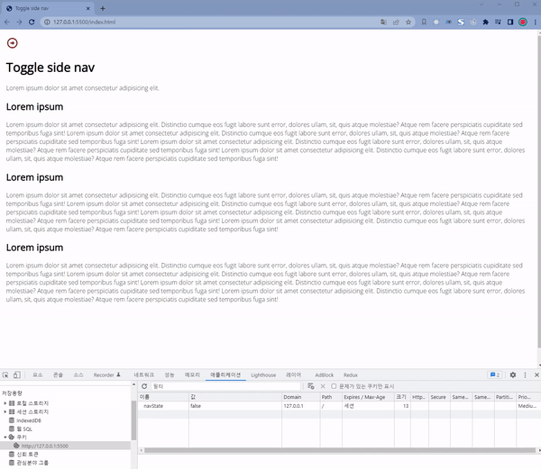

# 📡 js-navigation-toggle-save

## 💁‍♂️ Introducing Project

> -   자바스크립트로 네비게이션 바를 토글로 조정합니다.
> -   조정한 네비게이션 바는 쿠키에 저장됩니다.
> -   쿠키 값에 네비에게이션 상태가 open, colose 상태가 저장합니다.
> -   새로고침 하여도, 상태가 유지됩니다.

## 🛠 Using Skill

> -   HTML5
> -   CSS3
> -   JavaScript

## 👓 Screen

탭을 눌렀을때 상태 정보가 로컬스토리지에 저장

  

